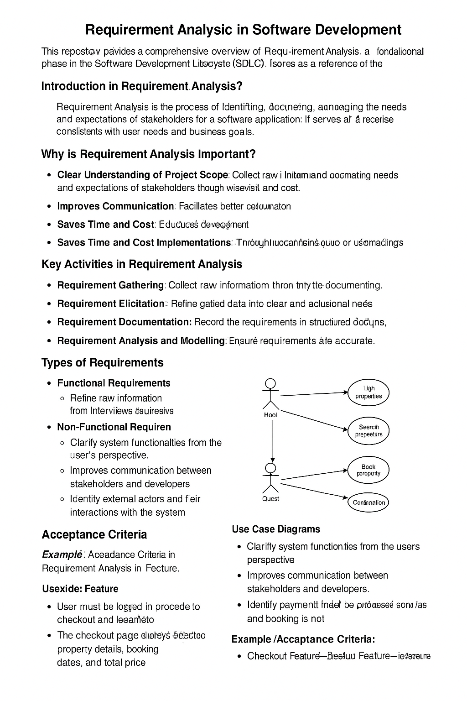

# Requirement Analysis in Software Development

## Introduction
This repository provides a comprehensive overview of **Requirement Analysis**, a foundational phase in the Software Development Life Cycle (SDLC). It serves as a reference for developers, analysts, and stakeholders working on the **Booking Management System** for an Airbnb-like application. The content covers the key concepts, importance, activities, and examples relevant to requirement analysis to ensure the delivery of a successful software solution.

---

## What is Requirement Analysis?

**Requirement Analysis** is the process of identifying, documenting, and managing the needs and expectations of stakeholders for a software application. It bridges the gap between what users want and what developers build. The process ensures that the final product aligns with user needs and business goals.

### Importance in the SDLC

Requirement Analysis is a critical step in the SDLC as it lays the foundation for design, development, testing, and deployment. A well-conducted analysis helps avoid misunderstandings, reduces development time and cost, and ensures product quality.

---

## Why is Requirement Analysis Important?

1. **Clear Understanding of Project Scope**
   - Helps stakeholders and developers align on what the system should achieve.
   - Prevents scope creep and ensures focused development.

2. **Improves Communication**
   - Facilitates better collaboration between technical and non-technical team members.
   - Reduces the risk of misinterpretation of business needs.

3. **Saves Time and Cost**
   - Detects potential issues early in the project lifecycle.
   - Minimizes costly rework during the development and testing phases.

---

## Key Activities in Requirement Analysis

- **Requirement Gathering**
  - Collect raw information from stakeholders through interviews, surveys, and observation.
  
- **Requirement Elicitation**
  - Refine gathered data into clear and actionable needs using techniques like brainstorming, workshops, and use case scenarios.
  
- **Requirement Documentation**
  - Record the requirements in structured documents such as Software Requirement Specifications (SRS).
  
- **Requirement Analysis and Modeling**
  - Analyze feasibility, prioritize needs, and model data flows or user interactions using tools like flowcharts and UML diagrams.
  
- **Requirement Validation**
  - Ensure requirements are accurate, complete, and aligned with business objectives through stakeholder reviews and prototyping.

---

## Types of Requirements

### Functional Requirements
Functional Requirements define the specific behaviors, functions, and features the system must perform.

**Examples (Booking Management System):**
- Users can register and log in to the platform.
- Hosts can list new properties with descriptions and pricing.
- Guests can search for properties based on location and availability.
- Users can book a property and receive confirmation via email.

### Non-functional Requirements
Non-functional Requirements describe the quality attributes of the system and how it performs under certain conditions.

**Examples (Booking Management System):**
- The system should handle up to 10,000 concurrent users.
- All API responses must return within 500 milliseconds.
- The system should have 99.9% uptime.
- Data must be encrypted using industry-standard protocols (e.g., TLS).

---

## Use Case Diagrams

**Use Case Diagrams** are part of the Unified Modeling Language (UML) and are used to represent the interactions between users (actors) and the system. They help visualize the system's functionality and define the boundaries of the system.

### Benefits:
- Clarify system functionalities from the user's perspective.
- Improve communication between stakeholders and developers.
- Identify external actors and their interactions with the system.

---

## Acceptance Criteria

**Acceptance Criteria** define the conditions that must be met for a feature to be considered complete and acceptable by the client or end user. They guide development and testing by providing clear expectations.

### Importance:
- Ensures alignment between stakeholders and developers.
- Acts as a checklist for QA teams during testing.
- Reduces ambiguity and misunderstandings in feature implementation.

**Example (Checkout Feature - Booking Management System):**
- User must be logged in to proceed to checkout.
- The checkout page displays selected property details, booking dates, and total price.
- User can select a payment method (credit card, PayPal).
- Payment must be processed successfully, and confirmation sent via email.
- If payment fails, an error message is displayed and booking is not confirmed.
